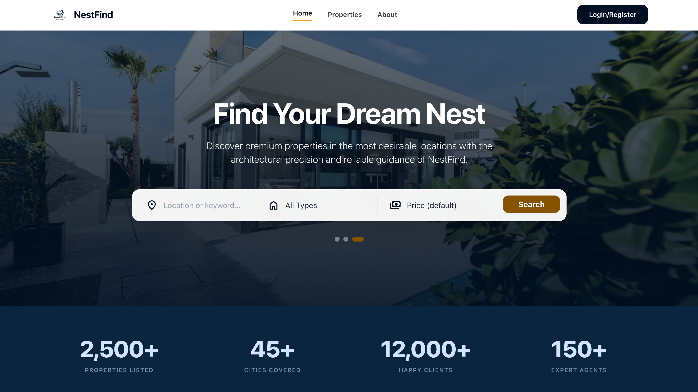

<div align="center">

# 🏡 NestFind

### Find Your Dream Nest

A modern, full-stack real estate platform for discovering, listing, and managing property listings — built with Next.js, TypeScript, and HeroUI.

[](https://nest-find-eta.vercel.app)
[](https://nextjs.org/)
[](https://www.typescriptlang.org/)
[](https://tailwindcss.com/)

[Live Site](https://nest-find-eta.vercel.app) · [Backend Repo](https://github.com/u2404057-cuet/Nest-find-server) · [Report an Issue](https://github.com/u2404057-cuet/Nest-find/issues)

</div>

---

## 📸 Preview



---

## 📖 Overview

NestFind is a full-stack property listing platform where buyers can search, filter, and inquire about properties across multiple cities, and agents can list, manage, and track their properties through a dedicated dashboard. This repository contains the **frontend** — the client-facing application. The API and database layer live in the [backend repository](https://github.com/u2404057-cuet/Nest-find-server).

## ✨ Features

- 🔍 **Property Search & Discovery** — keyword search with filters for property type, listing type, price range, bedrooms, and location
- 🏠 **Detailed Property Pages** — image galleries, specifications, amenities, agent contact, and related listings
- 🔐 **Authentication** — secure sign-up/login with role-based access (buyer / agent) powered by BetterAuth, plus a one-click demo login
- 📝 **Agent Dashboard** — add, edit, and manage property listings with a clean, protected interface
- 📊 **Analytics** — visual insights into listing views and inquiries using Recharts
- 💬 **Inquiries** — buyers can contact agents directly from a property's details page
- 📱 **Fully Responsive** — optimized layouts for mobile, tablet, and desktop
- ⚡ **Skeleton Loading States** — smooth perceived performance while data loads

## 🛠️ Tech Stack

| Category | Technology |
|---|---|
| Framework | [Next.js 16](https://nextjs.org/) (App Router) |
| Language | [TypeScript](https://www.typescriptlang.org/) |
| Styling | [Tailwind CSS](https://tailwindcss.com/) |
| UI Components | [HeroUI](https://www.heroui.com/) |
| Authentication | [BetterAuth](https://www.better-auth.com/) |
| Forms & Validation | [React Hook Form](https://react-hook-form.com/) |
| Charts | [Recharts](https://recharts.org/) |
| Deployment | [Vercel](https://vercel.com/) |

## 🚀 Live Deployment

| Environment | URL |
|---|---|
| Frontend | [nest-find-eta.vercel.app](https://nest-find-eta.vercel.app) |
| Backend API | [nest-find-server.vercel.app](https://nest-find-server.vercel.app) |

## 🧑‍💻 Getting Started

### Prerequisites

- Node.js 18.18 or later
- npm, yarn, or pnpm
- A running instance of the [NestFind backend](https://github.com/u2404057-cuet/Nest-find-server)

### Installation

```bash
# Clone the repository
git clone https://github.com/u2404057-cuet/Nest-find.git
cd Nest-find

# Install dependencies
npm install
```

### Environment Variables

Create a `.env.local` file in the project root:

```env
NEXT_PUBLIC_API_URL=http://localhost:8000
NEXT_PUBLIC_APP_URL=http://localhost:3000

BETTER_AUTH_SECRET=your_better_auth_secret
BETTER_AUTH_URL=http://localhost:3000
```

> Replace values with your production URLs when deploying (e.g. `https://nest-find-server.vercel.app`).

### Run the Development Server

```bash
npm run dev
```

Open [http://localhost:3000](http://localhost:3000) in your browser.

### Build for Production

```bash
npm run build
npm run start
```

## 📂 Project Structure

```
Nest-find/
├── app/
│   ├── (auth)/
│   │   ├── login/
│   │   └── register/
│   ├── properties/
│   │   ├── [id]/
│   │   ├── add/
│   │   └── manage/
│   ├── dashboard/
│   ├── about/
│   ├── contact/
│   └── page.tsx
├── components/
│   ├── Navbar.tsx
│   ├── Footer.tsx
│   ├── PropertyCard.tsx
│   └── ...
├── lib/
│   └── auth-client.ts
├── public/
└── package.json
```

## 🔗 Related Repositories

| Repo | Description |
|---|---|
| [Nest-find](https://github.com/u2404057-cuet/Nest-find) | Frontend (this repo) |
| [Nest-find-server](https://github.com/u2404057-cuet/Nest-find-server) | Backend API |

## 🗺️ Roadmap

- [ ] Social login (Google)
- [ ] Saved/favorited properties list
- [ ] In-app messaging between buyers and agents
- [ ] Map view for search results

## 🤝 Contributing

Contributions, issues, and feature requests are welcome. Feel free to check the [issues page](https://github.com/u2404057-cuet/Nest-find/issues).

## 📄 License

This project is open source and available under the [MIT License](LICENSE).

## 👤 Author

**Rahimul Islam**
Full-Stack Developer · CSE Student at CUET

- GitHub: [@u2404057-cuet](https://github.com/u2404057-cuet)

---

<div align="center">
Made with ❤️ using Next.js and TypeScript
</div>
